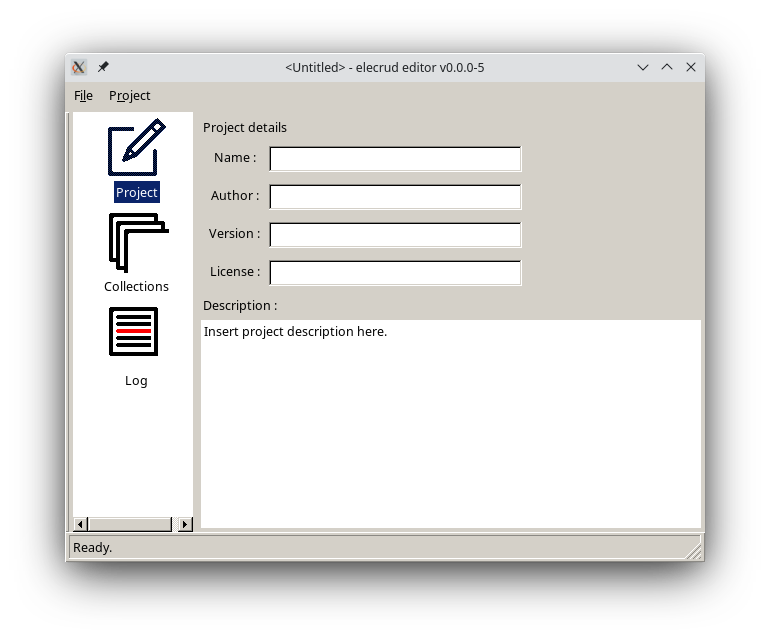

# elecrud

A C++/electron based multi-user CRUD operator program generator.

## Building

On debian-based distributions :

	sudo apt install libfox-1.6-dev libboost-dev libboost-test-dev \
	  libboost-serialization-dev graphviz

or on arch :

	sudo pacman -S cmake pkg-config fox boost graphviz

	mkdir build
	cmake ..
	make
	./electrud

## src/app

This directory contains the skeleton of the to-be-generated application.

## API documentation

The documentation is generated using `doxygen`, to install it :

	sudo pacman -S doxygen
	
The *Doxyfile* used as input file is generated by cmake :

	mkdir build
	cd build
	cmake ..
	doxygen

Then, you can open **html/index.html** using your favorite browser or the
*doxygen.log* for complete doxygen warning/error history.

If doxygen complains about `dot` and reports some *exit code 127* errors,
please double check you have the graphviz package installed and the dot
executable is in your PATH.

## Adding icon to the editor

Here is how to add a new icon list menu item icon to the MainWindow :

1. Icons are in GIF format and are stored in the *media/icons* directory;
2. Add the new one to the ICONS list in CMakeLists.txt;
3. The src/editor/Elecrud class must have it as a public FXIcon member and its
   constructor must obviously construct it with reswrap'ed Icons.hpp icon
   as constructor;
4. You just have to get it using `app->icon_name`.

Now, you need to handle panel creation and visibility.
